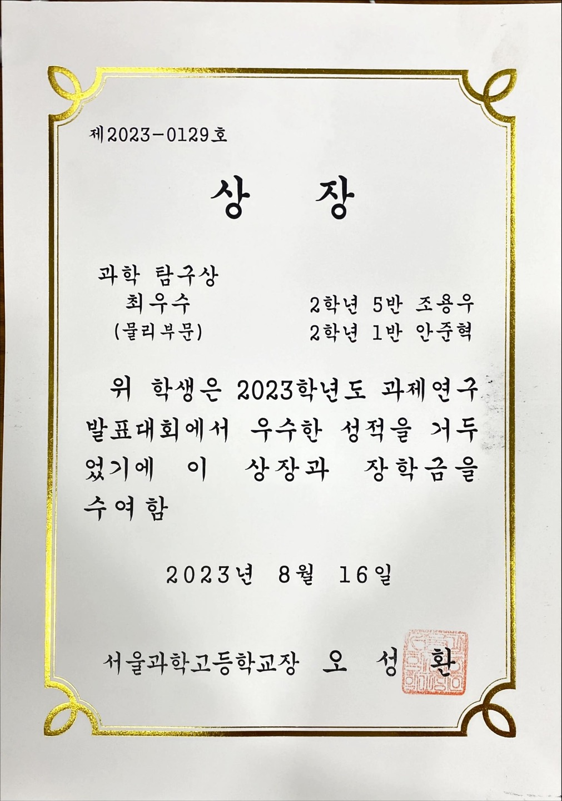
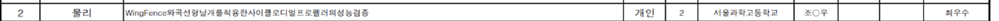
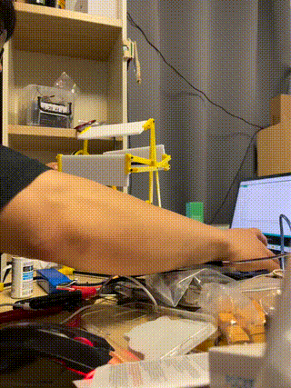
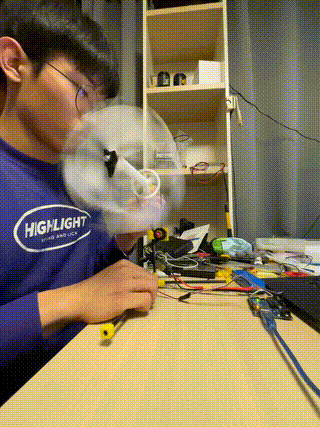
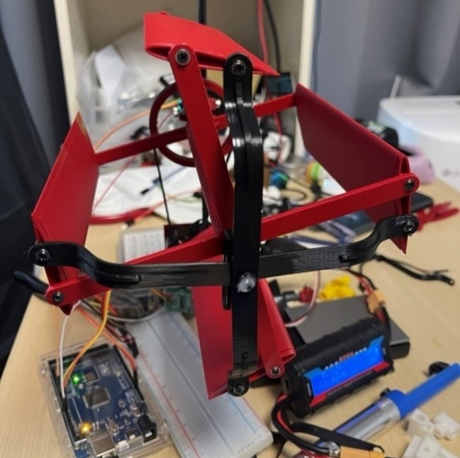
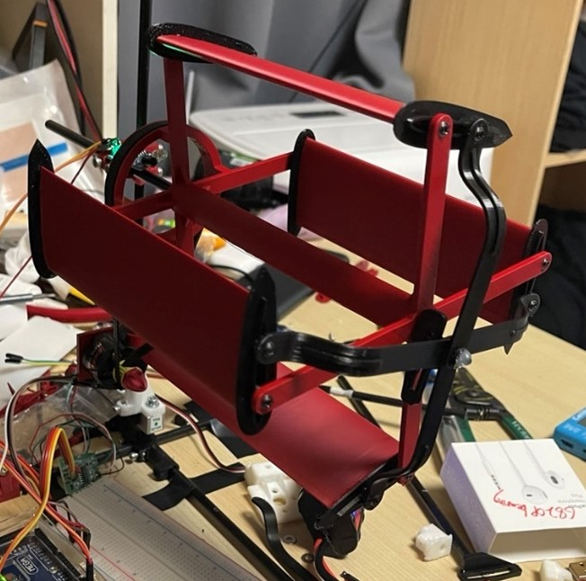
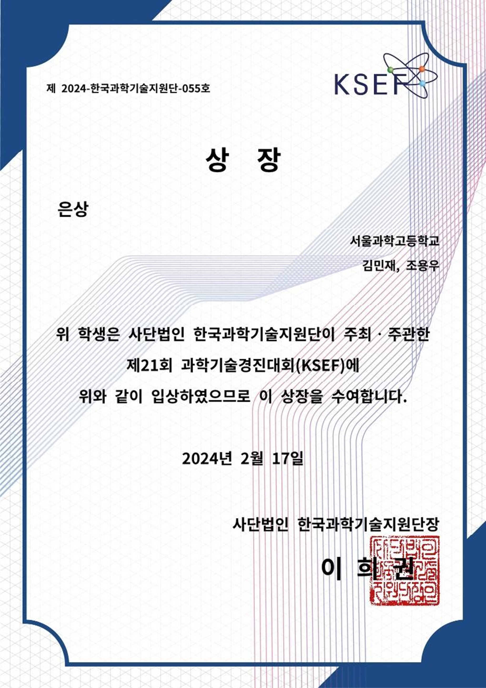

# Wing Fence and Relative Curvature applicance to a Cyclodial Propeller🚁
 사이클로디얼 프로펠러에 윙펜스와 상대 곡률 이론 적용시 일어나는 성능 변화를 실험적으로 검토했습니다.

## 📚 프로젝트 개요

이 저장소는 사이클로디얼 프로펠러의 성능을 개선하기 위한 연구를 담고 있습니다. 프로젝트는 여러 버전을 거쳐 발전했으며, 각 버전은 다양한 측면과 대회에 초점을 맞추었습니다.

## 🗂 저장소 구조

```
├─BUILD
│  ├─V0_V1_BUILD
│  └─V2_V3_BUILD
├─대회 출전 Documentation
│  ├─V0_교내과제연구
│  ├─V1_서울과학전람회예선
│  ├─V2_삼성휴먼테크논문대상
│  └─V3_KSEF CYC
└─데이터 및 실험 설계
    ├─Codes
    └─rawdata
```

## 🔬 연구 진행 과정

### V0: 교내 과제 연구
- Wing Fence와 Relative Curvature 개념 도입
- CFD(Computational Fluid Dynamics) 시뮬레이션 수행
#### 1차 모델 실험




### V1: 서울과학전람회 예선 최우수상
- 프로펠러 설계 개선
- 논문 개선 및 수정



### V2: 삼성휴먼테크논문대상
- 최종 프로토타입 제작 및 성능 테스트
- Variable Pitcher 설계로 Pitch Distance 조절 가능
- 다양한 측정 도구를 활용한 종합적인 성능 분석 (RPM, 소음, 전력 소비량 등)

- 초록 통과, 본선 탈락
#### 2차 모델
- 기존의 3D 출력 날개가 무거워 폼보드 적용 경량화
- 부품 최소화시키고 프레임을 카본파이버로 구성
- 맞물린 기어 대신 풀리와 벨트 사용
- 하지만 폼보드 가공 문제에 부딫혀 3D 프린터로 만들게 됨



#### 3차 모델
- NACA 0012 단면 형상 적용 날개
- Flaparm 내구도 문제 제외 완벽했다 -> 최종 모델에서 개선
- 2차 모델에 비하여 약간의 무게가 증가한 것이 단점



#### 최종 모델 : 


### V3: KSEF (Korea Science & Engineering Fair)
- 경량화 모델 LW-PLA 적용 실험
- 기존 프로펠러와의 성능 비교 분석
- 기존 프로펠러 실험 영상
  
  **Arduino Serial Monitor Loadcell & Tachometer RPM value**

- 최종 보고서 작성 및 개선



## 🛠 주요 연구 내용

1. [**프로펠러 설계 및 제작**](./BUILD/)
   - 3D 모델링 및 프린팅 (BUILD 폴더 참조)
   - 다양한 에어포일 설계 실험

2. [**성능 측정 및 분석**](./데이터%20및%20실험%20설계/)
   - Arduino를 이용한 데이터 수집
   - Python을 이용한 데이터 분석 및 시각화

3. [**Wing Fence 및 Relative Curvature 연구**](./대회%20출전%20Documentation/)
   - 이론적 배경 및 적용
   - 실험과 CFD를 통한 효과 검증

4. [**경량화 연구**](./대회%20출전%20Documentation/V3_KSEF%20CYC/)
   - LW PLA 활용 실험
   - 강성 유지와 경량화 사이의 균형점 모색

## 📊 데이터 및 결과

- 실험 원시 데이터: [`rawdata`](./데이터%20및%20실험%20설계/rawdata/) 폴더
- 데이터 분석 결과: [`데이터 및 실험 설계`](./데이터%20및%20실험%20설계/) 폴더
- 최종 연구 결과: [`대회 출전 Documentation/V3_KSEF CYC`](./대회%20출전%20Documentation/V3_KSEF%20CYC/) 폴더

## 🔮 향후 연구 방향

- 더욱 효율적인 에어포일 설계 탐구
- 다양한 소재를 활용한 경량화 연구 지속
- 실제 비행체 적용을 위한 스케일업 연구

## 📧 연락처

프로젝트에 대해 궁금한 점이 있으시면 언제든 연락 주세요!